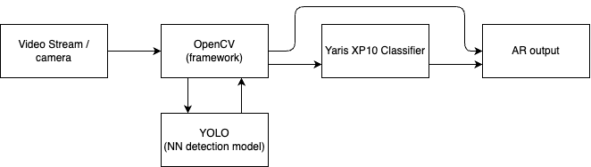

# Architecture suggestion 0.1

**Date:** _27.11.2024_
**Author:** _Lawrence_Pet_

For our first iteration of the Yaris detector we may use the power of open source tools and available models.
OpenCV and models like YOLO (You Only Look Once) are widely available and there are many examples
online of their usage. These models are allready able to detect and classify objects out of the box,
providing confidence values to the detection as well.

We can use the power of these models and open cv to detect objects, like cars, and then pass on objects iff they are cars to a specific model trained on detecting the one and only XP10 Yaris among pictures of cars.

Below is a conceptual diagram of the architecture

